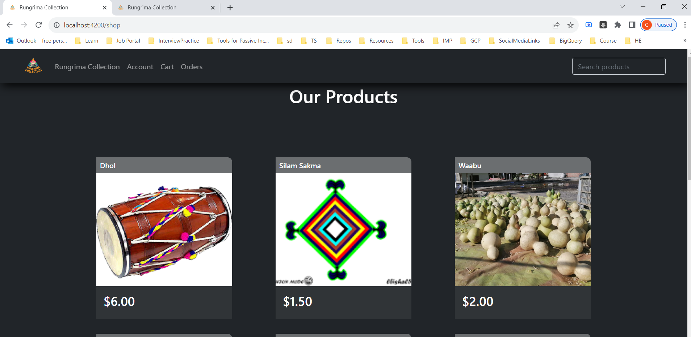
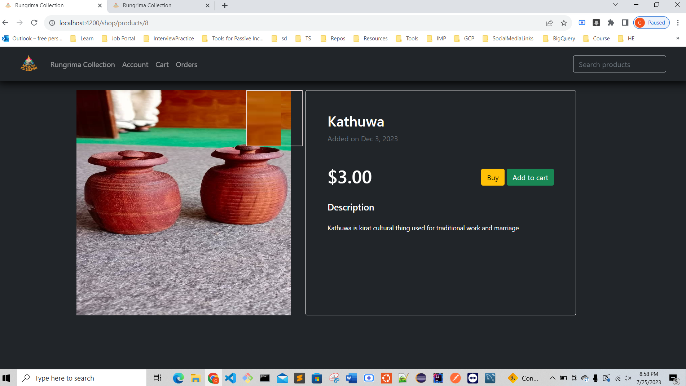
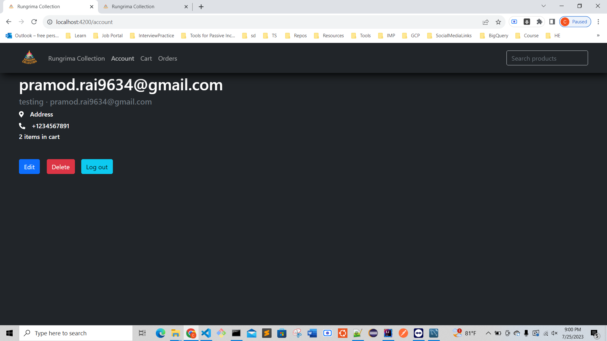
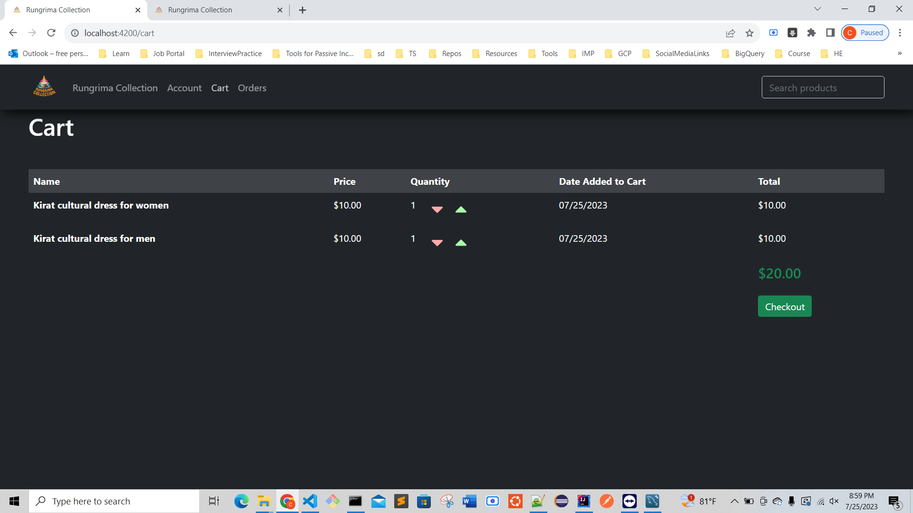
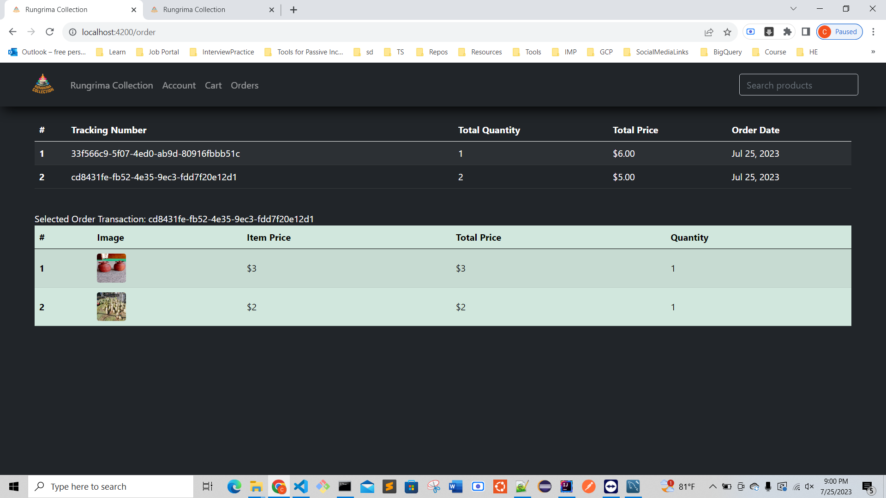
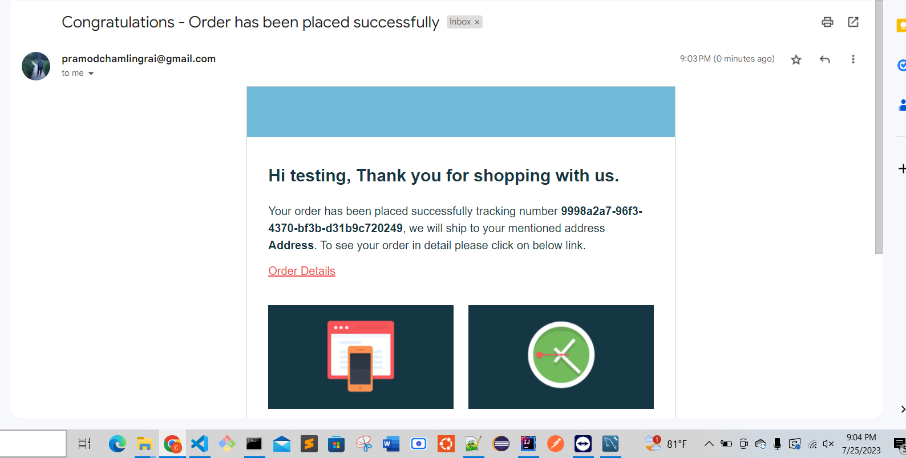

# E-Commerce Project

## Introduction

Welcome to the E-Commerce Project! This is a simple web application built using Angular and Spring Boot, allowing users to explore products, add items to their cart, place orders, and manage their accounts.

## Features

- Browse through a wide range of products.
- View detailed information and images of each product.
- Add items to the cart and adjust quantities.
- Create an account, log in, and manage your personal information.
- Place orders and track their status.
- Responsive design for optimal viewing on various devices.

## Technologies Used

The project is built using the following technologies:

- **Angular:** A frontend framework for building dynamic web applications.
- **Spring Boot:** A powerful framework for building Java-based web applications.
- **MySQL:** A relational database management system for storing application data.

## Getting Started

To run the project locally on your machine, follow these steps:

1. Clone the repository to your local machine.
2. Set up the backend using Spring Boot and MySQL.
3. Set up the frontend using Angular.
4. Launch the application and start exploring the features.

## Home Page

The Home Page welcomes users to the E-Commerce website. It showcases featured products and encourage them to explore further.

## Product Page

The Product Page provides detailed information about a specific product. Users can view product images, descriptions, prices, and other relevant details before deciding to add the item to their cart.

## Account Page

The Account Page allows users to manage their accounts. They can sign in or create a new account if they are new to the platform. Once logged in, users can update their personal information.

## Cart Page

The Cart Page displays all the items that users have added to their cart. From here, users can review their selected items, adjust quantities, and proceed to the checkout process.

## Order Page

It provides us all the orders which we placed their tracking numbers and details of the orders with quantities and prices.

## Email Confirmation

When we place the order it will provide us the confirmation email that the order has been placed successfully and the tracking link to track our orders.

## Contributing

We welcome contributions from the community to improve this project. Feel free to submit bug reports, feature requests, or pull requests through GitHub.

Thank you for checking out our E-Commerce Project! We hope you have a pleasant shopping experience. If you have any questions or need assistance, please feel free to contact us. Happy shopping!
